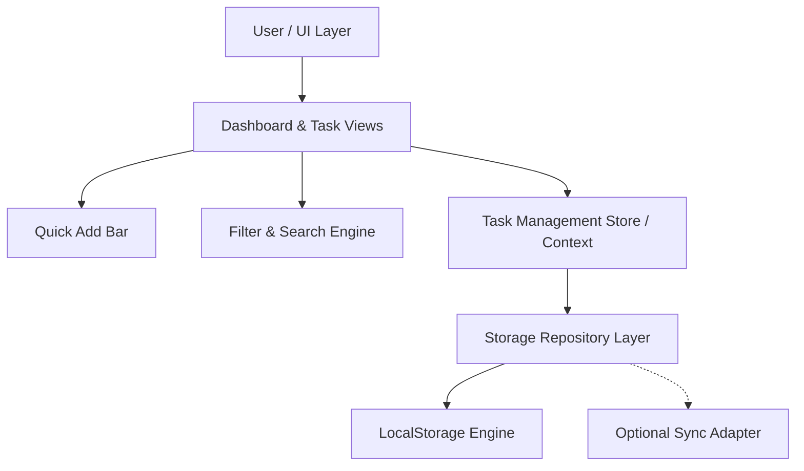

# Implementation Plan: Quick Tasks (Minimal Task Management Application)

## Goal Description
Build **Quick Tasks**, a minimalist, ultra-fast task management web application designed around the core principle: *"Capture fast. Organize simply. Get things done."*
The implementation delivers a high-performance, accessible, offline-first application with streamlined task creation, dynamic dashboard metrics, and real-time filtering/search based on [PRD.md](file:///home/mahmoud/Desktop/p2/PRD.md).

---

## Technical Architecture & Stack Recommendation



### Recommended Technology Stack
* **Frontend Framework:** React 18+ / TypeScript + Vite (Instant startup, type-safe, lightweight bundle)
* **Styling & Icons:** Tailwind CSS + Lucide React (Accessible, responsive, modern minimal aesthetic)
* **State Management:** Zustand or React Context + useReducer with LocalStorage persistence middleware (Zero-boilerplate, offline-ready)
* **Date Utilities:** date-fns for timezone-resilient date calculations and formatting
* **Testing:** Vitest + React Testing Library

---

## User Review Required

> [!IMPORTANT]
> **Tech Stack Alignment:** The plan specifies a **React + TypeScript + Vite + Tailwind CSS** architecture with an offline-first LocalStorage repository.

---

## Implementation Phases

```mermaid
gantt
    title Quick Tasks Implementation Roadmap
    dateFormat  X
    axisFormat %d
    section Phase 1
    Project Setup, Data & State Management :0, 2
    section Phase 2
    Dashboard & Core UI Components         :2, 4
    section Phase 3
    Task List, Search & Multi-Filter       :4, 6
    section Phase 4
    Edge Cases, A11y & Offline Polish      :6, 8
    section Phase 5
    Testing, QA & Documentation            :8, 10
```



---

### Phase 1: Project Setup, Data Architecture & State Management

**Objectives:** Initialize repository structure, TypeScript definitions, state management store, and persistence layer.

#### Key Deliverables:
1. **Project Scaffolding:**
   - Initialize Vite + React + TypeScript + Tailwind CSS project structure.
   - Configure Tailwind with design tokens (colors for High 🔴, Medium 🟡, Low 🟢 priorities, neutral dark/light theme tokens).
2. **Domain Models & Types (`src/types/task.ts`):**
   - Define `Task`, `Priority` (`'high' | 'medium' | 'low'`), `TaskStatus` (`'inbox' | 'todo' | 'completed'`), `ComputedStatus` (`'overdue' | 'today' | 'upcoming'`).
   - Define `FilterOptions` (status, priority, dateRange, category, query) and `SortOption`.
3. **Storage Repository (`src/services/storage.ts`):**
   - Offline-first LocalStorage adapter with JSON schema validation.
   - Repository abstraction (`ITaskRepository`) supporting CRUD, bulk operations, and seed demo data.
4. **Timezone & Date Utilities (`src/utils/date.ts`):**
   - ISO 8601 UTC storage with client local timezone formatting.
   - Dynamic computed status evaluators (`isOverdue`, `isToday`, `isUpcoming`).
5. **Task State Management Store (`src/store/useTaskStore.ts` or `src/context/TaskContext.tsx`):**
   - Core actions: `addTask`, `editTask`, `deleteTask`, `toggleComplete`, `setFilters`, `setSort`, `undoLastDelete`.
   - Automatic status derivation: calculate `overdue` for tasks with `dueDate < now` and `status !== 'completed'`.

---

### Phase 2: Dashboard & Core UI Components

**Objectives:** Build the main dashboard layout, summary metrics, and streamlined quick-add input bar.

#### Key Deliverables:
1. **Header Component (`src/components/Header.tsx`):**
   - Dynamic time-based greeting (*"Good morning" / "Good afternoon" / "Good evening"*).
   - Formatted localized current date.
   - Quick settings / Theme toggle (Light/Dark mode).
2. **Dashboard Summary Cards (`src/components/SummaryCards.tsx`):**
   - 4 live metric cards: **Total Tasks**, **Completed**, **Remaining**, **Overdue**.
   - Reactive count updates when tasks change or cross the overdue threshold.
3. **Quick Add Bar (`src/components/QuickAdd.tsx`):**
   - Single-line fast input field with optional quick selectors for Due Date, Time, and Priority.
   - Keyboard shortcut support (`Enter` to submit, `Tab` to navigate inputs).
   - Priority selector chips with accessible labels and color indicators.
4. **Today's Focus Section (`src/components/TodayTasks.tsx`):**
   - Section dedicated to tasks due today.
   - Empty state: *"You're all caught up 🎉"*.

---

### Phase 3: Interactive Task List, Search & Multi-Filter

**Objectives:** Implement full task lifecycle management, responsive lists, live search, and multi-criteria filtering.

#### Key Deliverables:
1. **Task Item Component (`src/components/TaskItem.tsx`):**
   - Instant-toggle checkbox with smooth micro-animation.
   - Title, due date & time badge, priority badge (🔴 High / 🟡 Medium / 🟢 Low with accessible labels).
   - Overdue badge indicator with warning icon.
   - Action buttons: Edit (inline / modal), Delete.
2. **Delete Confirmation & Undo Toast (`src/components/DeleteConfirmModal.tsx` & `src/components/Toast.tsx`):**
   - Confirmation dialog preventing accidental data loss.
   - Transient "Undo" snackbar (5-second window) to recover deleted tasks.
3. **Live Search Bar (`src/components/SearchBar.tsx`):**
   - Debounced instant search on task titles.
   - Empty state when no matches: *"No tasks found."*
4. **Multi-Filter & Sort Controls (`src/components/FilterBar.tsx`):**
   - Multi-criteria filter: Status (`All`, `Inbox`, `To Do`, `Completed`, `Overdue`), Priority (`High`, `Medium`, `Low`), Date (`Today`, `This Week`, `Overdue`).
   - One-click **"Clear All Filters"** button.
   - Sort dropdown: by Due Date, Priority, Title, or Created Date.

---

### Phase 4: Edge Cases, Accessibility, Offline-First & Polish

**Objectives:** Handle edge cases defined in PRD, ensure WCAG 2.1 AA accessibility, and optimize performance.

#### Key Deliverables:
1. **Edge Case Handlers:**
   - Tasks without date (handled cleanly in Inbox).
   - Past due date warning during creation/editing.
   - Duplicate task title warning (non-blocking notification).
   - Timezone change support (dates rendered using user's system timezone).
   - High-volume task rendering optimization (efficient virtualized list or memoized DOM).
2. **Accessibility (A11y) & Usability:**
   - Full keyboard navigation (`/` to search, `N` for new task, `Escape` to close modals/clear search).
   - ARIA labels for priority indicators (not relying on color alone).
   - High contrast ratios and visible focus rings.
3. **Offline & Persistence Resilience:**
   - Auto-saving to LocalStorage with data export/import (backup & restore JSON).
   - Offline detection banner and service worker readiness.

---

### Phase 5: Automated Testing & Verification

**Objectives:** Ensure reliability, test coverage, and acceptance criteria fulfillment.

#### Key Deliverables:
1. **Unit Tests:**
   - Status computation tests (overdue detection, completed toggle logic).
   - LocalStorage repository and fallback error handling.
2. **Component & Integration Tests:**
   - Task creation, completion, deletion workflow.
   - Search as-you-type and filter combinations.
   - Summary cards metrics recalculation.
3. **Acceptance Criteria Verification Matrix:**
   - Validate every criterion from [PRD.md](file:///home/mahmoud/Desktop/p2/PRD.md#L126-L155).

---

## Verification Plan

### Automated Tests
* Run unit and store tests:
  ```bash
  npm run test
  # or
  npx vitest run
  ```
* Run type checks and linter:
  ```bash
  npm run typecheck
  npm run lint
  ```
* Run production build check:
  ```bash
  npm run build
  ```

### Manual Verification Checklist
1. **Quick Add:** Create task with title, date, and priority -> verify immediate addition to the list.
2. **Task State & Dashboard Metrics:**
   - Add a task due today -> verify Today list and Total/Remaining cards increment.
   - Mark as completed -> verify Completed increments, Remaining decrements, checkmark animates.
   - Create task with past date -> verify marked as `Overdue` and Overdue metric card increments.
3. **Search & Multi-Filter:**
   - Search for partial text -> verify results filter as you type.
   - Apply multiple filters (e.g. `Priority: High` + `Status: To Do`) -> verify accurate combined result.
   - Click "Clear Filters" -> verify all tasks display.
4. **Delete & Undo:**
   - Delete task -> verify confirmation modal appears.
   - Confirm deletion -> verify task removed and Undo toast appears; clicking Undo restores task.
5. **A11y & Edge Cases:**
   - Navigate entire app with keyboard (`Tab`, `Space`, `Enter`, `/`).
   - Refresh page -> verify all data persists from storage.
