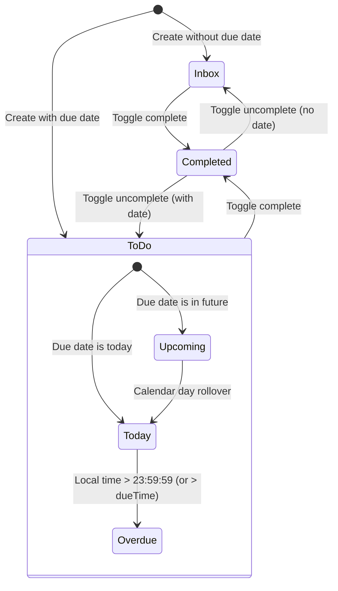

# Data Model: Core Dashboard & Quick Task Capture

**Feature Branch**: `001-core-dashboard-quickadd`  
**Date**: 2026-08-19  
**Status**: Complete  

---

## 1. Domain Entities & Schemas

### 1.1 Task Entity

Represents an actionable task item captured by the user.

| Field | Type | Required | Default | Description / Constraints |
| :--- | :--- | :--- | :--- | :--- |
| `id` | `string` | Yes | Auto-generated (`crypto.randomUUID()`) | Unique task identifier |
| `title` | `string` | Yes | - | Non-empty trimmed string, 1–500 chars |
| `priority` | `Priority` | Yes | `'medium'` | `'high' \| 'medium' \| 'low'` |
| `dueDate` | `string \| null` | No | `null` | ISO 8601 calendar date (`YYYY-MM-DD`) |
| `dueTime` | `string \| null` | No | `null` | 24-hour time string (`HH:mm`) |
| `status` | `TaskStatus` | Yes | Derived | `'inbox' \| 'todo' \| 'completed'` |
| `createdAt` | `string` | Yes | Current UTC ISO timestamp | Creation timestamp |
| `updatedAt` | `string` | Yes | Current UTC ISO timestamp | Last modification timestamp |

#### TypeScript Definition
```typescript
export type Priority = 'high' | 'medium' | 'low';

export type TaskStatus = 'inbox' | 'todo' | 'completed';

export type ComputedStatus = 'overdue' | 'today' | 'upcoming' | 'none';

export interface Task {
  id: string;
  title: string;
  priority: Priority;
  dueDate: string | null;   // e.g., "2026-08-19"
  dueTime: string | null;   // e.g., "17:00"
  status: TaskStatus;
  createdAt: string;        // ISO UTC timestamp
  updatedAt: string;        // ISO UTC timestamp
}

export interface TaskWithComputed extends Task {
  computedStatus: ComputedStatus;
}
```

---

### 1.2 Dashboard Metrics Entity

Dynamic aggregates calculated reactively from active and completed tasks.

| Field | Type | Description |
| :--- | :--- | :--- |
| `total` | `number` | Total number of tasks in the system |
| `completed` | `number` | Count of tasks with `status === 'completed'` |
| `remaining` | `number` | Count of active tasks (`status !== 'completed'`) |
| `overdue` | `number` | Count of active tasks with past due date/time |

#### TypeScript Definition
```typescript
export interface DashboardMetrics {
  total: number;
  completed: number;
  remaining: number;
  overdue: number;
}
```

---

### 1.3 User Settings Entity

User preferences stored locally.

| Field | Type | Default | Description |
| :--- | :--- | :--- | :--- |
| `theme` | `'light' \| 'dark'` | `'light'` (or system preference) | Active visual theme mode |

#### TypeScript Definition
```typescript
export type ThemeMode = 'light' | 'dark';

export interface UserSettings {
  theme: ThemeMode;
}
```

---

### 1.4 Persistence Storage Schema

LocalStorage JSON schema container.

```typescript
export interface StoragePayload {
  version: number;          // Schema version (currently: 1)
  tasks: Task[];
  settings: UserSettings;
}
```

---

## 2. State Lifecycle & Transitions



### Transition & Status Derivation Rules

1. **Initial Status Assignment**:
   - If `dueDate` is provided $\rightarrow$ `status = 'todo'`.
   - If `dueDate` is null $\rightarrow$ `status = 'inbox'`.
2. **Dynamic Computed Status**:
   - If `status === 'completed'` $\rightarrow$ `computedStatus = 'none'`.
   - If `status !== 'completed'`:
     - If `dueDate` is null $\rightarrow$ `computedStatus = 'none'`.
     - If `dueDate` < `currentDate` $\rightarrow$ `computedStatus = 'overdue'`.
     - If `dueDate` == `currentDate`:
       - If `dueTime` is provided AND `currentTime` > `dueTime` $\rightarrow$ `computedStatus = 'overdue'`.
       - Otherwise $\rightarrow$ `computedStatus = 'today'`.
     - If `dueDate` > `currentDate` $\rightarrow$ `computedStatus = 'upcoming'`.
3. **Completion Toggle**:
   - Toggling active task sets `status = 'completed'` and updates `updatedAt`.
   - Uncompleting restores previous status (`'todo'` if `dueDate` exists, else `'inbox'`).

---

## 3. Validation Rules

- **`title`**:
  - Must not be empty after trimming (`title.trim().length > 0`).
  - Max length: 500 characters.
  - Required for task creation.
- **`priority`**:
  - Must be one of `'high'`, `'medium'`, `'low'`. Defaults to `'medium'`.
- **`dueDate`**:
  - Must match `YYYY-MM-DD` format if present.
- **`dueTime`**:
  - Must match `HH:mm` (24-hour) format if present.
  - Allowed only if `dueDate` is also specified.
