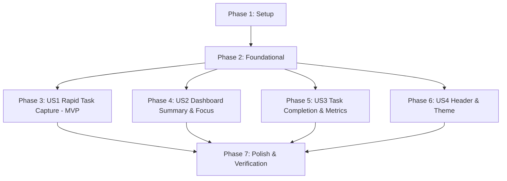

# Tasks: Core Dashboard & Quick Task Capture

**Input**: Design documents from `/specs/001-core-dashboard-quickadd/`  
**Prerequisites**: [plan.md](file:///home/mahmoud/Desktop/p2/specs/001-core-dashboard-quickadd/plan.md), [spec.md](file:///home/mahmoud/Desktop/p2/specs/001-core-dashboard-quickadd/spec.md), [research.md](file:///home/mahmoud/Desktop/p2/specs/001-core-dashboard-quickadd/research.md), [data-model.md](file:///home/mahmoud/Desktop/p2/specs/001-core-dashboard-quickadd/data-model.md), [contracts/](file:///home/mahmoud/Desktop/p2/specs/001-core-dashboard-quickadd/contracts/)  
**Tests**: Tests are required under Constitution Principle II (Test Evidence) and are included for each phase.  
**Organization**: Tasks are grouped by user story to enable independent implementation and testing.  

---

## Phase 1: Setup (Shared Infrastructure)

**Purpose**: Project initialization, build configuration, and testing setup.

- [X] T001 Initialize Vite + React + TypeScript project with Tailwind CSS configuration in package.json, vite.config.ts, tsconfig.json, and tailwind.config.js
- [X] T002 [P] Configure Vitest and React Testing Library setup in vitest.config.ts and tests/setup.ts
- [X] T003 [P] Set up base styling, design tokens, CSS variables, and dark mode classes in src/index.css

---

## Phase 2: Foundational (Blocking Prerequisites)

**Purpose**: Core domain types, date/status calculation engine, and LocalStorage persistence repository.

**⚠️ CRITICAL**: No user story work can begin until this phase is complete.

- [X] T004 [P] Implement domain entity interfaces (Task, Priority, TaskStatus, ComputedStatus, DashboardMetrics, UserSettings, StoragePayload) in src/types/task.ts and src/types/theme.ts
- [X] T005 [P] Implement timezone and date utility functions (computeStatus, isOverdue, isToday, getGreeting, formatLocalDate) in src/utils/date.ts
- [X] T006 [P] Create unit tests for date and computed status utility functions in tests/unit/date.test.ts
- [X] T007 Implement ITaskRepository interface and default seed data fixtures in src/repository/TaskRepository.ts
- [X] T008 Implement LocalStorageTaskRepository with schema validation, CRUD operations, and first-launch auto-seeding in src/repository/LocalStorageTaskRepository.ts
- [X] T009 [P] Create unit tests for LocalStorageTaskRepository persistence, CRUD, and fallback error handling in tests/unit/repository.test.ts
- [X] T010 Implement reactive task and theme state store context (TaskContext, TaskProvider, useTasks, useTheme) in src/context/TaskContext.tsx

**Checkpoint**: Foundation ready — user story implementation can now begin.

---

## Phase 3: User Story 1 - Rapid Task Capture (Priority: P1) 🎯 MVP

**Goal**: Enable users to quickly record actionable tasks with title, optional due date/time, and priority level (High, Medium, Low) using minimal keystrokes.

**Independent Test**: Enter a task title into the Quick Add bar, select priority and due date using inline selector chips, submit with Enter, and verify immediate persistence and state reflection.

### Tests for User Story 1
- [X] T011 [P] [US1] Create integration tests for QuickAdd input validation, inline chip selectors, and keyboard submission in tests/integration/QuickAdd.test.tsx

### Implementation for User Story 1
- [X] T012 [US1] Implement QuickAdd component with single-line title input, inline date/time selectors, accessible priority chips (🔴 High / 🟡 Medium / 🟢 Low), and Enter key submission in src/components/QuickAdd.tsx
- [X] T013 [US1] Mount QuickAdd within application layout and connect to TaskContext in src/App.tsx

**Checkpoint**: User Story 1 is functional and testable independently (MVP ready).

---

## Phase 4: User Story 2 - Real-Time Dashboard Summary & Focus (Priority: P2)

**Goal**: Provide users with instant orientation through 4 summary metric counters (Total, Completed, Remaining, Overdue) and a dedicated Today's Focus section.

**Independent Test**: Load the dashboard with existing tasks and verify all 4 metric counters accurately compute counts, and tasks due today appear in the Today's Focus list (or display empty state).

### Tests for User Story 2
- [X] T014 [P] [US2] Create integration tests for SummaryCards metric calculations and TodayTasks list rendering in tests/integration/DashboardMetrics.test.tsx

### Implementation for User Story 2
- [X] T015 [P] [US2] Implement SummaryCards component displaying Total, Completed, Remaining, and Overdue metric counters in src/components/SummaryCards.tsx
- [X] T016 [US2] Implement TodayTasks component displaying tasks due today with empty state message ("You're all caught up 🎉") in src/components/TodayTasks.tsx
- [X] T017 [US2] Integrate SummaryCards and TodayTasks into main dashboard layout in src/App.tsx

**Checkpoint**: User Stories 1 and 2 operate cohesively and are testable independently.

---

## Phase 5: User Story 3 - Today's Task Completion & Reactive Metrics (Priority: P3)

**Goal**: Allow users to mark tasks as completed directly from the Today's Focus list with immediate visual feedback and real-time metric updates (<50ms).

**Independent Test**: Click completion checkbox on a today's task; verify immediate completion style, Completed count +1, and Remaining count -1.

### Tests for User Story 3
- [X] T018 [P] [US3] Create integration tests for completion checkbox toggling and instantaneous metric counter recalculation in tests/integration/TaskCompletion.test.tsx

### Implementation for User Story 3
- [X] T019 [US3] Implement interactive completion toggle checkbox with micro-animations and completed strikethrough styling in src/components/TodayTasks.tsx
- [X] T020 [US3] Connect completion toggle action to TaskContext and ensure reactive metric updates in src/App.tsx

**Checkpoint**: User Stories 1, 2, and 3 are fully operational and testable.

---

## Phase 6: User Story 4 - Personalized Header & Theme Preference (Priority: P4)

**Goal**: Render a personalized header with contextual greeting, localized current date, and a persistent Light/Dark theme switcher.

**Independent Test**: Switch theme between Light and Dark mode, reload browser, and verify theme persists while greeting matches current time of day.

### Tests for User Story 4
- [X] T021 [P] [US4] Create integration tests for Header time-based greeting, formatted date, and theme toggle persistence in tests/integration/ThemeToggle.test.tsx

### Implementation for User Story 4
- [X] T022 [US4] Implement Header component with time-of-day greeting ("Good morning" / "Good afternoon" / "Good evening"), localized date, and theme toggle button in src/components/Header.tsx
- [X] T023 [US4] Connect theme switching to TaskContext and bind dark mode class to root HTML element in src/App.tsx

**Checkpoint**: All 4 user stories are fully implemented and integrated.

---

## Phase 7: Polish & Cross-Cutting Concerns

**Purpose**: Application bootstrapping, accessibility compliance checks, and end-to-end verification.

- [X] T024 [P] Wire application entry point with TaskProvider in src/main.tsx and render root layout in src/App.tsx
- [X] T025 [P] Audit and verify WCAG 2.1 AA accessibility (visible focus rings, contrast ratios, ARIA labels for priority badges) in src/components/QuickAdd.tsx and src/components/TodayTasks.tsx
- [X] T026 Validate all end-to-end scenarios per quickstart.md validation guide in specs/001-core-dashboard-quickadd/quickstart.md

---

## Dependencies & Execution Order

### Phase Dependencies

### User Story Dependencies

- **US1 (P1)**: Starts immediately after Foundational (Phase 2). No dependencies on other stories.
- **US2 (P2)**: Starts after Foundational (Phase 2). Consumes task state populated by US1 or seed data.
- **US3 (P3)**: Starts after Foundational (Phase 2) / US2 component structure. Adds toggle behavior to TodayTasks.
- **US4 (P4)**: Starts after Foundational (Phase 2). Independent header and theme preference management.

### Parallel Opportunities

- **Phase 1**: `T002` (testing setup) and `T003` (CSS setup) in parallel after `T001`.
- **Phase 2**: `T004` (types), `T005` (date utils), `T006` (date tests), and `T009` (repo tests) can run in parallel.
- **Phase 3–6 Tests**: `T011` [US1], `T014` [US2], `T018` [US3], `T021` [US4] can be written in parallel.
- **Phase 7**: `T024` and `T025` can run in parallel before `T026`.

---

## Implementation Strategy

### MVP First (User Story 1 Only)
1. Complete **Phase 1: Setup** (`T001`–`T003`).
2. Complete **Phase 2: Foundational** (`T004`–`T010`).
3. Complete **Phase 3: User Story 1** (`T011`–`T013`).
4. **Validate MVP**: Test rapid task capture and LocalStorage persistence.

### Incremental Delivery
1. Foundation + US1 $\rightarrow$ Functional task capture (MVP).
2. Add US2 $\rightarrow$ Real-time summary metrics & Today's Focus list.
3. Add US3 $\rightarrow$ Interactive completion toggles with reactive counts.
4. Add US4 $\rightarrow$ Personalized header, localized date, and dark/light mode toggle.
5. Complete Phase 7 $\rightarrow$ Full QA and quickstart validation.
