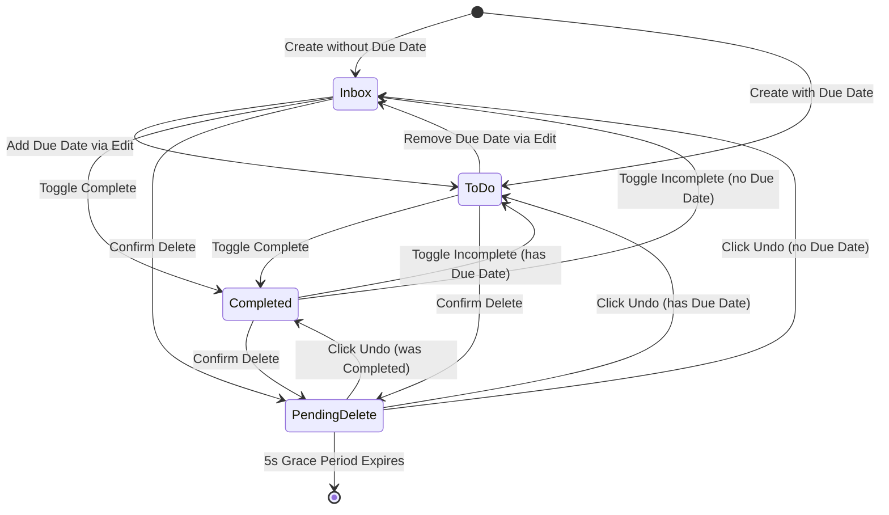

# Data Model: Interactive Task List, Search, Filters & Resilience

**Feature Branch**: `002-task-list-search-filter`  
**Date**: 2026-08-19  

---

## 1. Domain Entities & TypeScript Definitions

### Task
Represents an individual actionable item.

```typescript
export type Priority = 'high' | 'medium' | 'low';

export type TaskStatus = 'inbox' | 'todo' | 'completed';

export type ComputedStatus = 'overdue' | 'today' | 'upcoming' | 'none';

export interface Task {
  /** Unique RFC4122 v4 UUID or timestamp fallback */
  id: string;
  /** Task title (1 to 500 characters, trimmed) */
  title: string;
  /** Importance level: high (🔴), medium (🟡), low (🟢) */
  priority: Priority;
  /** Optional ISO calendar date string: YYYY-MM-DD */
  dueDate: string | null;
  /** Optional 24-hour time string: HH:mm */
  dueTime: string | null;
  /** Task lifecycle state */
  status: TaskStatus;
  /** ISO 8601 UTC creation timestamp */
  createdAt: string;
  /** ISO 8601 UTC last modification timestamp */
  updatedAt: string;
}

export interface TaskWithComputed extends Task {
  /** Dynamic temporal status computed against active client clock */
  computedStatus: ComputedStatus;
}
```

### Filter State
Represents the active multi-dimensional filter and search criteria.

```typescript
export type FilterStatus = 'all' | 'inbox' | 'todo' | 'completed' | 'overdue';
export type FilterPriority = 'all' | 'high' | 'medium' | 'low';
export type FilterDateRange = 'all' | 'today' | 'this_week' | 'overdue';

export type SortField = 'dueDate' | 'priority' | 'title' | 'createdAt';
export type SortDirection = 'asc' | 'desc';

export interface FilterOptions {
  /** Case-insensitive title search query */
  query: string;
  /** Status filter chip */
  status: FilterStatus;
  /** Priority filter chip */
  priority: FilterPriority;
  /** Date range filter chip */
  dateRange: FilterDateRange;
}

export interface SortOption {
  field: SortField;
  direction: SortDirection;
}
```

### Undo Record
Represents a transient snapshot of a deleted task pending finalization.

```typescript
export interface UndoRecord {
  /** Full task snapshot */
  task: Task;
  /** Original array index before deletion for exact position restoration */
  index: number;
  /** Epoch timestamp when deletion was triggered */
  deletedAt: number;
  /** Timeout identifier for the 5-second grace window */
  timeoutId?: NodeJS.Timeout | number;
}
```

### Backup Payload
Represents the serialized JSON export/import package.

```typescript
export interface BackupPayload {
  /** Schema version indicator for backwards compatibility */
  version: number;
  /** ISO 8601 export timestamp */
  exportedAt: string;
  /** Complete array of tasks */
  tasks: Task[];
  /** User preferences */
  settings: {
    theme: 'light' | 'dark';
  };
}
```

### Dashboard Metrics
Represents aggregated statistics across all tasks.

```typescript
export interface DashboardMetrics {
  /** Total count of all tasks in the system */
  total: number;
  /** Count of tasks with status === 'completed' */
  completed: number;
  /** Count of tasks with status !== 'completed' */
  remaining: number;
  /** Count of uncompleted tasks with computedStatus === 'overdue' */
  overdue: number;
}
```

---

## 2. Validation Rules & Invariants

1. **Title Validation**:
   - Must be between 1 and 500 characters after `trim()`.
   - Cannot be empty or whitespace-only.
   - Non-blocking duplicate warning displayed if another uncompleted task shares the exact same title.
2. **Priority Validation**:
   - Must be one of `'high'`, `'medium'`, `'low'`. Defaults to `'medium'`.
3. **Date & Time Validation**:
   - `dueDate`: Must match `YYYY-MM-DD` regex format or be `null`.
   - `dueTime`: Must match `HH:mm` (00:00 to 23:59) regex format or be `null`. If `dueTime` is set, `dueDate` is required.
   - Past due assignment: Permitted; displays a non-blocking warning and instantly derives `computedStatus = 'overdue'`.
4. **Status Derivation & Invariants**:
   - If `status === 'completed'`, `computedStatus` is always `'none'`.
   - If `dueDate === null`, `computedStatus` is always `'none'` and status defaults to `'inbox'`.
   - If `dueDate < todayStr`, `computedStatus` is `'overdue'`.
   - If `dueDate === todayStr`:
     - If `dueTime` is set and `currentTimeStr > dueTime`, `computedStatus` is `'overdue'`.
     - Otherwise, `computedStatus` is `'today'`.
   - If `dueDate > todayStr`, `computedStatus` is `'upcoming'`.

---

## 3. State Transitions



---

## 4. Multi-Filter & Sort Evaluation Matrix

Given task $T$ with title query $q$, status filter $S$, priority filter $P$, date filter $D$:

1. **Search Match**: $q = \emptyset \lor \text{lowercase}(T.\text{title}) \supseteq \text{lowercase}(q)$
2. **Status Match**: 
   - $S = \text{'all'} \implies \text{true}$
   - $S = \text{'inbox'} \implies T.\text{status} = \text{'inbox'}$
   - $S = \text{'todo'} \implies T.\text{status} = \text{'todo'}$
   - $S = \text{'completed'} \implies T.\text{status} = \text{'completed'}$
   - $S = \text{'overdue'} \implies T.\text{computedStatus} = \text{'overdue'}$
3. **Priority Match**: $P = \text{'all'} \lor T.\text{priority} = P$
4. **Date Match**:
   - $D = \text{'all'} \implies \text{true}$
   - $D = \text{'today'} \implies T.\text{dueDate} = \text{todayStr}$
   - $D = \text{'this\_week'} \implies T.\text{dueDate} \ge \text{todayStr} \land T.\text{dueDate} \le \text{endOfWeekStr}$
   - $D = \text{'overdue'} \implies T.\text{computedStatus} = \text{'overdue'}$

A task is displayed if and only if:
$$\text{Match}(T) = \text{Search Match}(T) \land \text{Status Match}(T) \land \text{Priority Match}(T) \land \text{Date Match}(T)$$
